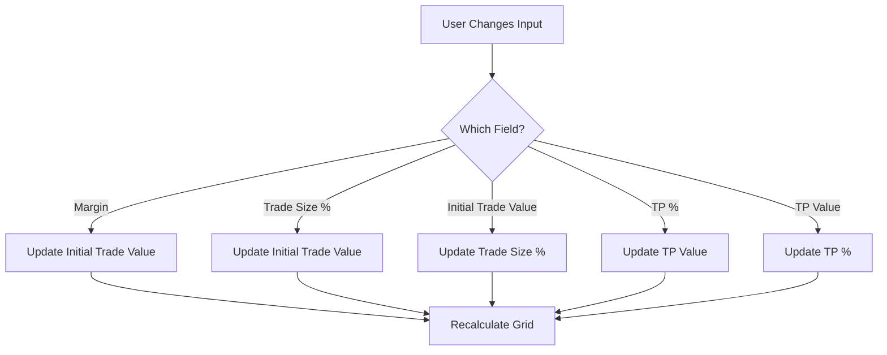
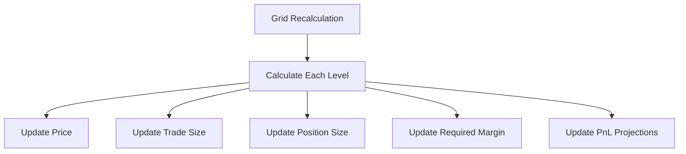

# Trade Settings Calculations Documentation

## Overview
This document provides a detailed breakdown of all trade settings calculations, their interdependencies, and how they update based on user input.

## Market Data Updates
- Manual update via Update button
- Optional auto-update every 5 minutes (disabled by default)
- Auto-update can be toggled using the switch
- Update process fetches fresh data from:
  - Binance API for price and volume
  - CoinGecko API for market caps

## Input Fields and Their Relationships

### 1. Initial Capital (Margin)
- Field ID: `margin`
- Default: 1000 USDT
- Triggers:
  - When changed: Recalculates `initialTradeValue` if `tradeSizePercent` is not being edited
  - Formula: `initialTradeValue = margin * (tradeSizePercent / 100)`

### 2. Initial Trade Size Percentage
- Field ID: `tradeSizePercent`
- Default: 10%
- Triggers:
  - When changed: Updates `initialTradeValue` if not manually edited
  - When `initialTradeValue` changes: Updates to `(initialTradeValue / margin) * 100`
- Formula: `initialTradeValue = margin * (tradeSizePercent / 100)`

### 3. Initial Trade Value
- Field ID: `initialTradeValue`
- Default: Calculated (100 USDT with default settings)
- Triggers:
  - When manually changed: Updates `tradeSizePercent`
  - When calculated: Result of margin × tradeSizePercent
- Two-way relationship:
  ```javascript
  // When tradeSizePercent changes
  initialTradeValue = margin * (tradeSizePercent / 100)
  
  // When initialTradeValue is manually changed
  tradeSizePercent = (initialTradeValue / margin) * 100
  ```

### 4. Take Profit Settings
- Fields: `tpPercent` and `tpValue`
- Default TP%: 10%
- Triggers:
  - When TP% changes: Updates TP Value if not being edited
  - When TP Value changes: Updates TP%
- Formulas:
  ```javascript
  // When TP% changes
  tpValue = initialTradeValue * leverage * (tpPercent / 100)
  
  // When TP Value is manually changed
  tpPercent = (tpValue * 100) / (initialTradeValue * leverage)
  ```

### 5. Grid Configuration
- Fields:
  - `gridLevels` (Default: 5)
  - `gridSize` (Default: 5%)
  - `gridMultiplier` (Default: 0.9)
  - `tradeSizeMultiplier` (Default: 1.15)

#### Grid Level Calculations
For each level i (0 to gridLevels-1):
```javascript
// Grid Size for level
currentGridSize = i === 0 ? gridSize : previousGridSize * gridMultiplier

// Price for level
priceLevel = previousPrice * (1 - (currentGridSize / 100))

// Trade Size for level
tradeSize = initialTradeValue * Math.pow(tradeSizeMultiplier, i)

// Position Size
positionSize = tradeSize * leverage

// Required Margin
requiredMargin = tradeSize

// Percent from Entry
percentFromEntry = ((priceLevel - entryPrice) / entryPrice) * 100

// PnL at Take Profit
pnlAtTp = (tradeSize * leverage * tpPercent) / 100
```

## Calculation Flow

### 1. Initial Input Change


### 2. Grid Recalculation


## Decimal Handling
- Price decimals match entry price precision
- All calculations maintain precision through computation
- Final display values are formatted to match entry price decimals
```javascript
const decimalPlaces = entryPriceStr.includes('.') ? 
    entryPriceStr.split('.')[1].length : 2;
const formatMatchingDecimals = (value) => value.toFixed(decimalPlaces);
```

## Input Validation Rules
1. All numeric inputs must be positive
2. Grid levels must be integer > 0
3. Percentages must be > 0
4. Multipliers must be > 0
5. Leverage must be ≥ 1

## Event Listeners
```javascript
const tradingInputs = [
    marginInput,
    tradeSizePercentInput,
    leverageInput,
    gridLevelsInput,
    gridSizeInput,
    gridMultiplierInput,
    tradeSizeMultiplierInput,
    entryPriceInput,
    tpPercentInput,
    initialTradeValueInput,
    tpValueInput
];

tradingInputs.forEach(input => {
    input.addEventListener('input', handleInputChange);
});
```

## Calculation Priority
1. Validate all inputs
2. Calculate initial trade value
3. Calculate take profit targets
4. Generate grid levels
5. Calculate position sizes
6. Calculate required margins
7. Update UI elements

## Error Handling
- Invalid inputs trigger warning in console
- Calculations abort if required inputs are invalid
- NaN results are prevented through default values
- Division by zero is checked and prevented

## Performance Considerations
- Calculations run on input change
- Throttled to prevent excessive updates
- Results are cached where possible
- DOM updates are batched

## Default Values Reset
```javascript
function setDefaultValues() {
    marginInput.value = '1000'
    tradeSizePercentInput.value = '10'
    leverageInput.value = '3'
    gridLevelsInput.value = '5'
    gridSizeInput.value = '5'
    gridMultiplierInput.value = '0.9'
    tradeSizeMultiplierInput.value = '1.15'
    tpPercentInput.value = '10'
}
